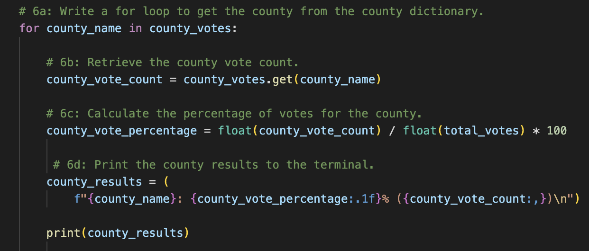
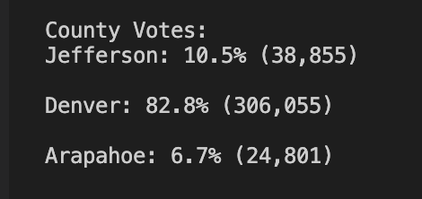
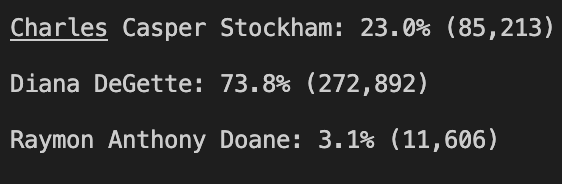
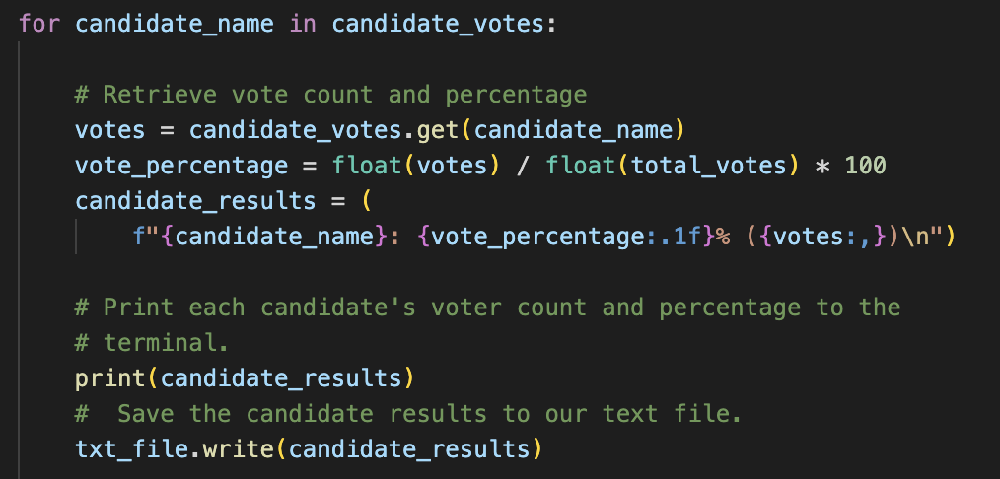
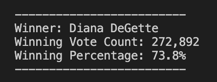
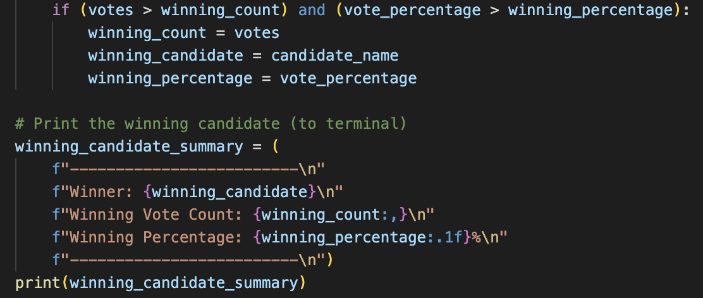

# Election_Analysis

## Project Overview

A Colorado Board of Elections employee has assigned the following tasks to complete the election audit of a recent local congressional election. The given the tasks were to report the total number of votes cast, the total number of votes for each candidate, the percentage of votes for each candidate, and the winner of the election based on the popular vote.

1. Calculate the total number of votes cast.
    The total number of votes cast during the election was 369,711. The screenshot of the code and the text file can be seen below.
     
    
2. Get a complete list or candidates who received votes.
    Charles Casper Stockham
    Diana DeGette
    Raymon Anthony Doane
    
3. Calculate the total number of votes each candidate received.
    Charles Casper Stockham: 85,213
    Diana DeGette: 272,892
    Raymon Anthony Doane: 11,606
    
4. Calculate the total number of votes and percentage for each county.
    Jefferson: 10.5% (38,855)
    Denver: 82.8% (306,055)
    Arapahoe: 6.7% (24,801)
    
    The screenshot of the code can be seen below.
     
    
5. Calculate the percentage of votes each candidate won.
    Charles Casper Stockham: 23%
    Diana DeGette: 73.8%
    Raymon Anthony Doane: 3.1%
    
    The screenshot of the code and the text file can be seen below.
      
    
6. Determine the winner of the election based on popular vote.
    The winner of the election was Diane DeGette.
    
    The screenshot of the code and the text file can be seen below.
     
    
## Resources
- Data Source: election_results.csv 
- Software: Python 3.6.1, Visual Studio Code, 1.38.1

## Summary
The analysis of the election show that:
- There were 369,711 votes cast in the election. 
- The candidates were
    - Candidate 1: Charles Casper Stockham
    - Candidate 2: Diana DeGette
    - Candidate 3: Raymon Anthony Doane
- The candidate results were:
    - Candidate 1 (Charles Casper Stockham) received 23% of the vote and 85,213 number of votes.
    - Candidate 2 (Diane DeGette) received 73.8% of the vote and 272,892 number of votes. 
    - Candidate 3 (Raymon Anthony Doane) received 3.1% of the vote and 11,606 number of votes.
- The winner of the election was:
    - Candidate 2 (Diane DeGette), who received 73.8% of the vote and 272,892 number of votes.

## Challenge Summary
    This script can be used in other forms of elections such as the presidential elections of a country, where the county names would be changed to the         state names. In addition, modifying the script to analyse which political parties were popular in each state in the country.

